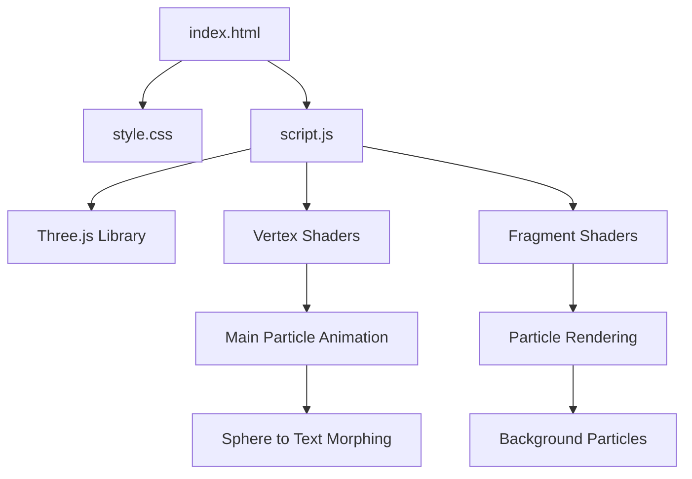

# 3D Spherical Particle Morph

An interactive WebGL visualization that morphs particles from a sphere shape into text and back again, using Three.js shaders for stunning visual effects.

## Project Structure



## Mathematical Concepts

```mermaid
graph LR
    A[Sphere Generation] --> B[Fibonacci Spiral Method]
    B --> C[x = r × cosθ × sinΦ]
    B --> D[y = r × sinθ × sinΦ]
    B --> E[z = r × cosΦ]
    E --> F[Uniform Distribution]
    
    G[Text Generation] --> H[Canvas Rasterization]
    H --> I[Pixel Sampling]
    I --> J[Coordinate Mapping]
    
    K[Morphing Animation] --> L[Linear Interpolation]
    L --> M[pos = mix(spherePos, textPos, uMix)]
    
    N[Explosion Effect] --> O[Noise Functions]
    O --> P[x = sin(p×0.8+t) × cos(p×0.8+t)]
    O --> Q[Vector Normalization]
    
    R[Particle Rotation] --> S[2D Rotation Matrix]
    S --> T[x' = x×cos(α) - y×sin(α)]
    S --> U[y' = x×sin(α) + y×cos(α)]
```

## Features
- Smooth morphing animation between a 3D sphere and custom text
- Interactive text input to change the displayed message
- Dynamic particle physics with explosion effects
- Background particle field for depth
- Responsive design that adapts to window resizing
- Glassmorphism UI elements with purple accent colors

## How It Works

1. **Particle Generation**: 
   - Generates particles in a spherical formation using mathematical algorithms
   - Creates text particles by rendering text to a canvas and sampling pixel data

2. **Animation Cycle**:
   - 0-4s: Sphere rotation
   - 4-9s: Morph from sphere to text with explosion effect
   - 9-15s: Text display
   - 15-20s: Morph from text back to sphere with explosion
   - 20-24s: Sphere rotation (loop repeats)

3. **Shaders**:
   - Custom GLSL vertex shaders for particle positioning and movement
   - Custom fragment shaders for particle rendering and coloring
   - Dynamic uniforms for time-based animations

## Usage

1. Open `index.html` in a modern web browser
2. View the automatic animation cycle
3. Enter custom text in the input field and click "Create" to change the displayed message

## Dependencies

- [Three.js](https://threejs.org/) (Loaded via CDN)

## Browser Support

Works in all modern browsers that support WebGL. Requires a device capable of running WebGL applications.

## Developer

Developed by [AAAhmad the dev](https://aaahmadthedev.vercel.app/)